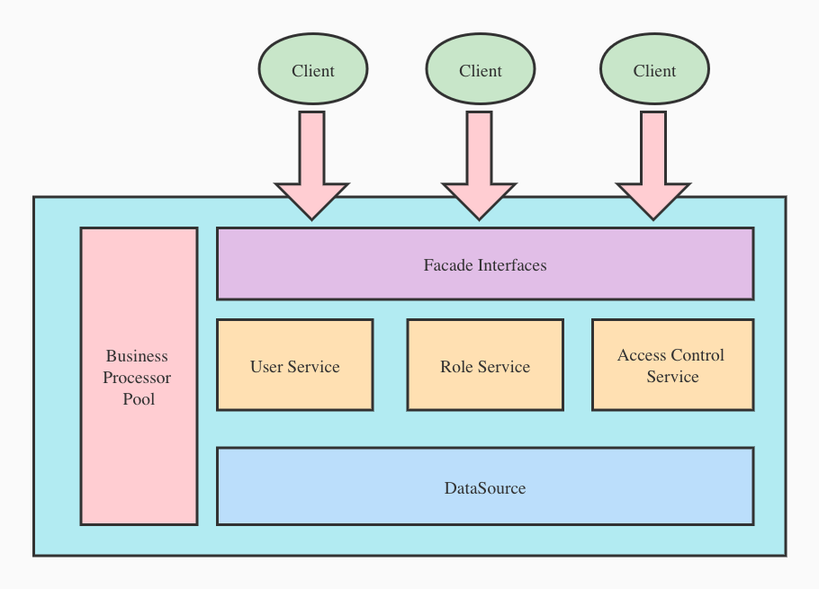
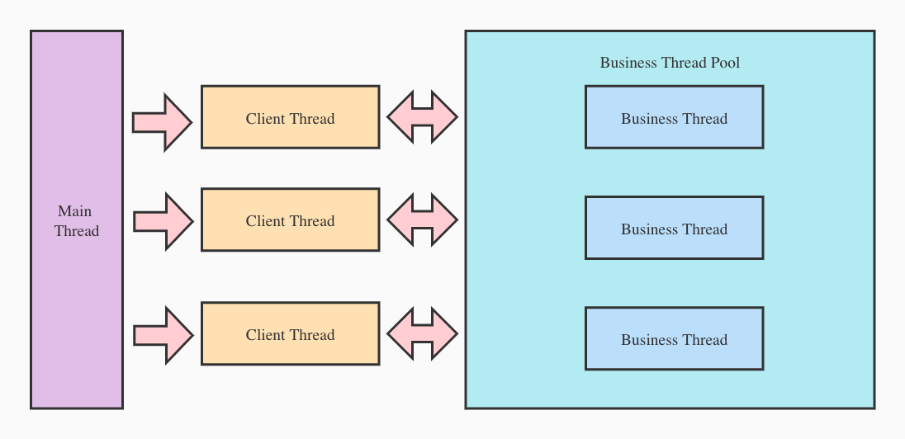
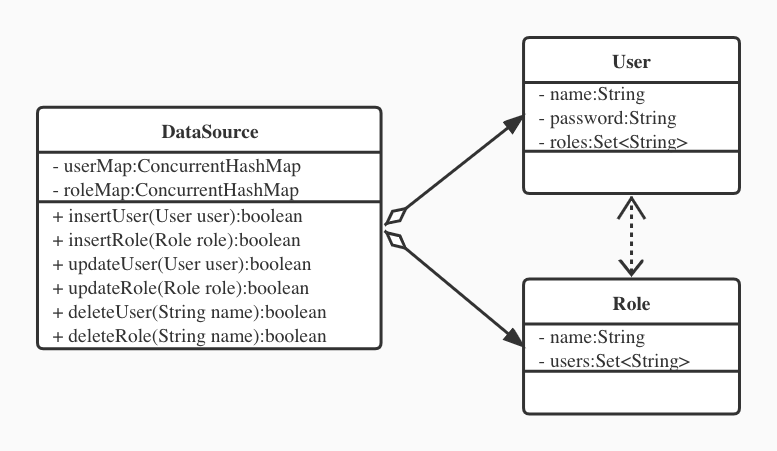

# Simple Authentication Demo

## 1 需求简述
### 1.1 业务实体
开发一个授权和鉴权的服务，包含以下实体：
1. 用户（包含用户名和密码）
2. 角色（包含角色名）
用户和角色之间是多对多关系：一个用户可以关联多个角色，一个角色可以被多个用户关联

### 1.2 服务支持的能力
模拟一个服务，支持客户端进行如下操作：
1. 创建/删除 用户
2. 创建/删除 角色
3. 给用户授权角色
4. 鉴权（校验用户名密码，通过后生成token用于维护会话）
5. 查询用户拥有的角色

### 1.3 关于服务模型
提供的接口不涉及网络IO，在进程内模拟调用接口方法即可，通过测试用例验证
不需要持久化的数据源，数据保存在内存中即可

## 2 核心模块设计

### 2.1 整体模块划分
整体设计图如下：


可对任务拆分成以下几个主要模块：
1. 数据源
2. 业务处理服务
   - 用户
   - 角色
   - 鉴权
3. 业务线程池
4. 对外门面接口

线程模型图如下：

本次需求客户端、服务端都在一个进程中完成，通过测试用例的方式触发操作，所以图中的主线程就是测试用例的启动线程，然后在主线程中启动线程模拟客户端，直接调用目标服务的接口方法模拟接口调用，目标服务在处理接口请求时会统一丢到线程池中进行处理，待处理完成后，返回处理结果给客户端线程。

### 2.2 服务入口
##### 关键类
1. 应用对象 : com.gmail.gao.gary.Application
    - 饿汉式单例
    - 初始化对外暴露的 facade 对象
    - 对 facade 对象进行统一增强：
        - 统一异常处理
        - 引入业务线程池处理业务流程

### 2.3 数据模型
##### 关键类
1. 数据源 : com.gmail.gao.gary.datasource.DataSource：
    - 饿汉式单例
    - 封装了数据（User 和 Role）
    - 提供了数据操作入口

##### 数据结构
数据保存在内存中，uml类图如下：

- User 和 Role 的唯一键是name，通过ConcurrentHashMap组成数据集，key是name，未避免线程安全问题用ConcurrentHashMap存储
- User会通过roles属性关联Role，roles里面存的是关联的Role信息，通过ConcurrentHashMap存储
- Role也会通过users属性关联User，users里面存的是关联的User信息，通过ConcurrentHashMap存储
- User 和 Role 做更新的时候需要绑定或解绑彼此的关联关系，这部分规则封装在DataSource中，DataSource是对数据及其操作的封装，服务启动的时候会创建一个单例

### 2.4 核心业务处理
##### 关键类
1. User服务 : com.gmail.gao.gary.service.UserService
    - 饿汉式单例
    - 依赖DataSource
    - User相关业务逻辑
        - 创建User
        - 删除User
        - 关联Role

2. Role服务 : com.gmail.gao.gary.service.RoleService
    - 饿汉式单例
    - 依赖DataSource
    - Role相关业务逻辑
        - 创建Role
        - 删除Role

3. 鉴权服务 : com.gmail.gao.gary.service.AccessControlService
    - 饿汉式单例
    - 依赖DataSource
    - 鉴权相关业务逻辑
        - 验证登陆信息（根据用户名、密码返回token）
        - 验证角色权限
        - 查询用户拥有的所有角色权限

### 2.5 业务线程池
##### 关键类
1. 线程工厂 : com.gmail.gao.gary.common.processor.BusinessThreadFactory
    - 自定义线程工厂，支持自定义命名
    - 自定义ThreadGroup，用于区分其它线程

2. 业务线程池处理器 : com.gmail.gao.gary.common.processor.BusinessExecutor
    - 饿汉式单例
    - 线程池封装处理类
    - 固定大小线程池，用于处理业务流程

### 2.6 门面接口
##### 关键类
1. 对外User接口实现 : com.gmail.gao.gary.facade.impl.UserFacadeImpl
    - 实现接口 com.gmail.gao.gary.facade.UserFacade
    - UserService 的门面类，对外暴露接口，会被注册到 Application 实例中

2. 对外Role接口实现 : com.gmail.gao.gary.facade.impl.RoleFacadeImpl
    - 实现接口 com.gmail.gao.gary.facade.RoleFacade
    - RoleService 的门面类，对外暴露接口，会被注册到 Application 实例中

3. 对外鉴权接口实现 : com.gmail.gao.gary.facade.impl.AccessControlFacadeImpl
    - 实现接口 com.gmail.gao.gary.facade.AccessControlFacade
    - AccessControlService 的门面类，对外暴露接口，会被注册到 Application 实例中

### 2.7 门面增强代理
##### 关键类
1. 增强代理处理器 : com.gmail.gao.gary.common.proxy.FacadeInvocationHandler
    - 用 JDK动态代理 实现对门面接口的增强
    - 将目标方法 封装成 Callable Task 丢到业务线程池中去处理
    - 为目标方法增加统一的 异常处理，封装异常信息到统一的 Result对象中去

### 2.8 其它通用模块
##### 关键类
1. 统一配置管理 : com.gmail.gao.gary.common.config.CommonConfig
    - 饿汉式单例
    - 读取classpath下的 common.properties 配置文件，配置文件包含的内容有
        - password.encrypt.seed 用户密码加密的种子
        - token.encrypt.seed token 加密的种子
        - token.timeout.threshold token超时时间（单位秒，当前为测试方便配置成1秒）
    - 提供多个配置读取接口，用于读取不同类型的配置参数

2. 加密工具 : com.gmail.gao.gary.common.utils.EncryptUtil
    - 提供静态工具方法，实现了简单的加密和解密
    - 加密算法：使用配置的加密种子字符串对原始序列进行异或运算
    - 解密算法：和加密算法相同

## 3 测试用例设计

### 3.1 核心模块单测
- 加密算法单测（com.gmail.gao.gary.common.utils.EncryptUtilTest）
    - 先加密，后解密，得到的序列和原来相等
    - 执行main方法开始测试

- 数据源单测（com.gmail.gao.gary.datasource.DataSourceTest）
    - 验证数据增删改查
    - 执行main方法开始测试

### 3.2 业务场景测试
- 简单的自定义测试工具（com.gmail.gao.gary.TestUtil）
    - 统一的控制台数据测试内容打印

- 业务场景统一测试（com.gmail.gao.gary.ApplicationTest）
    - 在静态属性中初始化：
        - 实例化 Application
        - 从 Application 中获得对外的门面接口
        - 获得 DataSource 实例，用于一些数据内容d验证
    - 执行main方法开始测试:

- 涉及业务场景
    - testCreateAndDeleteUser：测试创建/删除用户
    - testCreateAndDeleteRole：测试创建/删除角色
    - testAddRoleToUser：测试角色关联
    - testAuthenticate：测试鉴权
    - testInvalidate：测试token获取和token有效性
    - testCheckRole：测试角色校验
    - testAllRoles：测试角色查询
    - testMultiClient：测试多客户端并发访问，验证多业务线程处理生效

# 4 附录

### 4.1 业务场景测试日志记录

```

========   Test Case 1 : testCreateAndDeleteUser  =======
[BusinessExecutorContext] threadName=BusinessExecutor-1-thread-1, threadGroup=BusinessExecutorGroup, start executing method=UserFacade.createUser
[BusinessExecutorContext] threadName=BusinessExecutor-1-thread-1, threadGroup=BusinessExecutorGroup, end executing method=UserFacade.createUser
create userName = user1, userPwd = pwd1
user in dataSource userName = user1, encrypted userPwd = AEW
[BusinessExecutorContext] threadName=BusinessExecutor-1-thread-2, threadGroup=BusinessExecutorGroup, start executing method=UserFacade.deleteUser
[BusinessExecutorContext] threadName=BusinessExecutor-1-thread-2, threadGroup=BusinessExecutorGroup, end executing method=UserFacade.deleteUser
delete user result = success = true, data = null
user in dataSource = null
[BusinessExecutorContext] threadName=BusinessExecutor-1-thread-3, threadGroup=BusinessExecutorGroup, start executing method=UserFacade.deleteUser
[BusinessExecutorContext] threadName=BusinessExecutor-1-thread-3, threadGroup=BusinessExecutorGroup, end executing method=UserFacade.deleteUser
delete user result = success = false, errorMsg = user named user1 dosen't exist
========   Test Result = true

========   Test Case 2 : testCreateAndDeleteRole  =======
[BusinessExecutorContext] threadName=BusinessExecutor-1-thread-4, threadGroup=BusinessExecutorGroup, start executing method=RoleFacade.createRole
[BusinessExecutorContext] threadName=BusinessExecutor-1-thread-4, threadGroup=BusinessExecutorGroup, end executing method=RoleFacade.createRole
create roleName = role1
role in dataSource userName = role1
[BusinessExecutorContext] threadName=BusinessExecutor-1-thread-5, threadGroup=BusinessExecutorGroup, start executing method=RoleFacade.deleteRole
[BusinessExecutorContext] threadName=BusinessExecutor-1-thread-5, threadGroup=BusinessExecutorGroup, end executing method=RoleFacade.deleteRole
delete role result = success = true, data = null
role in dataSource = null
[BusinessExecutorContext] threadName=BusinessExecutor-1-thread-1, threadGroup=BusinessExecutorGroup, start executing method=RoleFacade.deleteRole
[BusinessExecutorContext] threadName=BusinessExecutor-1-thread-1, threadGroup=BusinessExecutorGroup, end executing method=RoleFacade.deleteRole
delete role result = success = false, errorMsg = role named role1 dosen't exist
========   Test Result = true

========   Test Case 3 : testAddRoleToUser  =======
[BusinessExecutorContext] threadName=BusinessExecutor-1-thread-2, threadGroup=BusinessExecutorGroup, start executing method=UserFacade.createUser
[BusinessExecutorContext] threadName=BusinessExecutor-1-thread-2, threadGroup=BusinessExecutorGroup, end executing method=UserFacade.createUser
[BusinessExecutorContext] threadName=BusinessExecutor-1-thread-3, threadGroup=BusinessExecutorGroup, start executing method=UserFacade.createUser
[BusinessExecutorContext] threadName=BusinessExecutor-1-thread-3, threadGroup=BusinessExecutorGroup, end executing method=UserFacade.createUser
[BusinessExecutorContext] threadName=BusinessExecutor-1-thread-4, threadGroup=BusinessExecutorGroup, start executing method=RoleFacade.createRole
[BusinessExecutorContext] threadName=BusinessExecutor-1-thread-4, threadGroup=BusinessExecutorGroup, end executing method=RoleFacade.createRole
[BusinessExecutorContext] threadName=BusinessExecutor-1-thread-5, threadGroup=BusinessExecutorGroup, start executing method=RoleFacade.createRole
[BusinessExecutorContext] threadName=BusinessExecutor-1-thread-5, threadGroup=BusinessExecutorGroup, end executing method=RoleFacade.createRole
[BusinessExecutorContext] threadName=BusinessExecutor-1-thread-1, threadGroup=BusinessExecutorGroup, start executing method=UserFacade.addRole
[BusinessExecutorContext] threadName=BusinessExecutor-1-thread-1, threadGroup=BusinessExecutorGroup, end executing method=UserFacade.addRole
[BusinessExecutorContext] threadName=BusinessExecutor-1-thread-2, threadGroup=BusinessExecutorGroup, start executing method=UserFacade.addRole
[BusinessExecutorContext] threadName=BusinessExecutor-1-thread-2, threadGroup=BusinessExecutorGroup, end executing method=UserFacade.addRole
[BusinessExecutorContext] threadName=BusinessExecutor-1-thread-3, threadGroup=BusinessExecutorGroup, start executing method=UserFacade.addRole
[BusinessExecutorContext] threadName=BusinessExecutor-1-thread-3, threadGroup=BusinessExecutorGroup, end executing method=UserFacade.addRole
[BusinessExecutorContext] threadName=BusinessExecutor-1-thread-4, threadGroup=BusinessExecutorGroup, start executing method=UserFacade.addRole
[BusinessExecutorContext] threadName=BusinessExecutor-1-thread-4, threadGroup=BusinessExecutorGroup, end executing method=UserFacade.addRole
------ data info: 
name=user1, password=AEW, roles=[role1 role2 ]
name=user1, password=AEW, roles=[role1 role2 ]
name=role1, roles=[user1 user2 ]
name=role2, roles=[user1 ]
========   Test Result = true

========   Test Case 4 : testAuthenticate  =======
[BusinessExecutorContext] threadName=BusinessExecutor-1-thread-5, threadGroup=BusinessExecutorGroup, start executing method=AccessControlFacade.authenticate
[BusinessExecutorContext] threadName=BusinessExecutor-1-thread-5, threadGroup=BusinessExecutorGroup, end executing method=AccessControlFacade.authenticate
authRes1 = success = true, data = T>SUQRVUUVPY[ZV
[BusinessExecutorContext] threadName=BusinessExecutor-1-thread-1, threadGroup=BusinessExecutorGroup, start executing method=AccessControlFacade.authenticate
authRes2 = success = false, errorMsg = wrong password
------ data info: 
name=user1, password=AEW, roles=[role1 role2 ]
name=user1, password=AEW, roles=[role1 role2 ]
name=role1, roles=[user1 user2 ]
name=role2, roles=[user1 ]
========   Test Result = true

========   Test Case 5 : testInvalidate  =======
[BusinessExecutorContext] threadName=BusinessExecutor-1-thread-2, threadGroup=BusinessExecutorGroup, start executing method=AccessControlFacade.authenticate
[BusinessExecutorContext] threadName=BusinessExecutor-1-thread-2, threadGroup=BusinessExecutorGroup, end executing method=AccessControlFacade.authenticate
authRes1 = success = true, data = T>SUQRVUUVPY[ZW
[BusinessExecutorContext] threadName=BusinessExecutor-1-thread-3, threadGroup=BusinessExecutorGroup, start executing method=AccessControlFacade.checkRole
[BusinessExecutorContext] threadName=BusinessExecutor-1-thread-3, threadGroup=BusinessExecutorGroup, end executing method=AccessControlFacade.checkRole
checkRoleRes1 = success = true, data = true
sleep for 2 seconds
[BusinessExecutorContext] threadName=BusinessExecutor-1-thread-4, threadGroup=BusinessExecutorGroup, start executing method=AccessControlFacade.checkRole
checkRoleRes2 = success = false, errorMsg = token is timeout
========   Test Result = true

========   Test Case 6 : testCheckRole  =======
[BusinessExecutorContext] threadName=BusinessExecutor-1-thread-5, threadGroup=BusinessExecutorGroup, start executing method=AccessControlFacade.authenticate
[BusinessExecutorContext] threadName=BusinessExecutor-1-thread-5, threadGroup=BusinessExecutorGroup, end executing method=AccessControlFacade.authenticate
authRes1 = success = true, data = W>SUQRVUUVSPRSU
[BusinessExecutorContext] threadName=BusinessExecutor-1-thread-1, threadGroup=BusinessExecutorGroup, start executing method=AccessControlFacade.checkRole
[BusinessExecutorContext] threadName=BusinessExecutor-1-thread-1, threadGroup=BusinessExecutorGroup, end executing method=AccessControlFacade.checkRole
checkRoleRes1 = success = true, data = false
[BusinessExecutorContext] threadName=BusinessExecutor-1-thread-2, threadGroup=BusinessExecutorGroup, start executing method=AccessControlFacade.checkRole
[BusinessExecutorContext] threadName=BusinessExecutor-1-thread-2, threadGroup=BusinessExecutorGroup, end executing method=AccessControlFacade.checkRole
checkRoleRes2 = success = true, data = true
sleep for 2 seconds
[BusinessExecutorContext] threadName=BusinessExecutor-1-thread-3, threadGroup=BusinessExecutorGroup, start executing method=AccessControlFacade.checkRole
checkRoleRes3 = success = false, errorMsg = token is timeout
========   Test Result = true

========   Test Case 7 : testAllRoles  =======
[BusinessExecutorContext] threadName=BusinessExecutor-1-thread-4, threadGroup=BusinessExecutorGroup, start executing method=AccessControlFacade.authenticate
[BusinessExecutorContext] threadName=BusinessExecutor-1-thread-4, threadGroup=BusinessExecutorGroup, end executing method=AccessControlFacade.authenticate
authRes1 = success = true, data = T>SUQRVUUVSRRSS
[BusinessExecutorContext] threadName=BusinessExecutor-1-thread-5, threadGroup=BusinessExecutorGroup, start executing method=AccessControlFacade.authenticate
[BusinessExecutorContext] threadName=BusinessExecutor-1-thread-5, threadGroup=BusinessExecutorGroup, end executing method=AccessControlFacade.authenticate
authRes2 = success = true, data = W>SUQRVUUVSRRSS
[BusinessExecutorContext] threadName=BusinessExecutor-1-thread-1, threadGroup=BusinessExecutorGroup, start executing method=AccessControlFacade.queryAllRoles
[BusinessExecutorContext] threadName=BusinessExecutor-1-thread-1, threadGroup=BusinessExecutorGroup, end executing method=AccessControlFacade.queryAllRoles
queryAllRolesRes1 = success = true, data = [role1, role2]
[BusinessExecutorContext] threadName=BusinessExecutor-1-thread-2, threadGroup=BusinessExecutorGroup, start executing method=AccessControlFacade.queryAllRoles
[BusinessExecutorContext] threadName=BusinessExecutor-1-thread-2, threadGroup=BusinessExecutorGroup, end executing method=AccessControlFacade.queryAllRoles
queryAllRolesRes2 = success = true, data = [role1]
sleep for 2 seconds
[BusinessExecutorContext] threadName=BusinessExecutor-1-thread-3, threadGroup=BusinessExecutorGroup, start executing method=AccessControlFacade.queryAllRoles
queryAllRolesRes3 = success = false, errorMsg = token is timeout
========   Test Result = true

========   Test Case 8 : testMultiClient  =======
[BusinessExecutorContext] threadName=BusinessExecutor-1-thread-5, threadGroup=BusinessExecutorGroup, start executing method=UserFacade.createUser
[BusinessExecutorContext] threadName=BusinessExecutor-1-thread-1, threadGroup=BusinessExecutorGroup, start executing method=UserFacade.createUser
[BusinessExecutorContext] threadName=BusinessExecutor-1-thread-4, threadGroup=BusinessExecutorGroup, start executing method=UserFacade.createUser
[BusinessExecutorContext] threadName=BusinessExecutor-1-thread-1, threadGroup=BusinessExecutorGroup, end executing method=UserFacade.createUser
[BusinessExecutorContext] threadName=BusinessExecutor-1-thread-4, threadGroup=BusinessExecutorGroup, end executing method=UserFacade.createUser
[BusinessExecutorContext] threadName=BusinessExecutor-1-thread-2, threadGroup=BusinessExecutorGroup, start executing method=UserFacade.createUser
[BusinessExecutorContext] threadName=BusinessExecutor-1-thread-3, threadGroup=BusinessExecutorGroup, start executing method=UserFacade.createUser
Thread-0: executeResult=success = true, data = null
[BusinessExecutorContext] threadName=BusinessExecutor-1-thread-5, threadGroup=BusinessExecutorGroup, end executing method=UserFacade.createUser
[BusinessExecutorContext] threadName=BusinessExecutor-1-thread-1, threadGroup=BusinessExecutorGroup, start executing method=UserFacade.createUser
[BusinessExecutorContext] threadName=BusinessExecutor-1-thread-3, threadGroup=BusinessExecutorGroup, end executing method=UserFacade.createUser
[BusinessExecutorContext] threadName=BusinessExecutor-1-thread-1, threadGroup=BusinessExecutorGroup, end executing method=UserFacade.createUser
[BusinessExecutorContext] threadName=BusinessExecutor-1-thread-2, threadGroup=BusinessExecutorGroup, end executing method=UserFacade.createUser
Thread-2: executeResult=success = true, data = null
Thread-1: executeResult=success = true, data = null
[BusinessExecutorContext] threadName=BusinessExecutor-1-thread-5, threadGroup=BusinessExecutorGroup, start executing method=UserFacade.createUser
Thread-3: executeResult=success = true, data = null
[BusinessExecutorContext] threadName=BusinessExecutor-1-thread-5, threadGroup=BusinessExecutorGroup, end executing method=UserFacade.createUser
[BusinessExecutorContext] threadName=BusinessExecutor-1-thread-4, threadGroup=BusinessExecutorGroup, start executing method=UserFacade.createUser
Thread-4: executeResult=success = true, data = null
[BusinessExecutorContext] threadName=BusinessExecutor-1-thread-3, threadGroup=BusinessExecutorGroup, start executing method=UserFacade.createUser
Thread-6: executeResult=success = true, data = null
[BusinessExecutorContext] threadName=BusinessExecutor-1-thread-2, threadGroup=BusinessExecutorGroup, start executing method=UserFacade.createUser
[BusinessExecutorContext] threadName=BusinessExecutor-1-thread-3, threadGroup=BusinessExecutorGroup, end executing method=UserFacade.createUser
[BusinessExecutorContext] threadName=BusinessExecutor-1-thread-4, threadGroup=BusinessExecutorGroup, end executing method=UserFacade.createUser
Thread-5: executeResult=success = true, data = null
Thread-7: executeResult=success = true, data = null
Thread-8: executeResult=success = true, data = null
[BusinessExecutorContext] threadName=BusinessExecutor-1-thread-2, threadGroup=BusinessExecutorGroup, end executing method=UserFacade.createUser
Thread-9: executeResult=success = true, data = null
========   Test Result = true

 Total Result: success = 8, fail = 0

```


